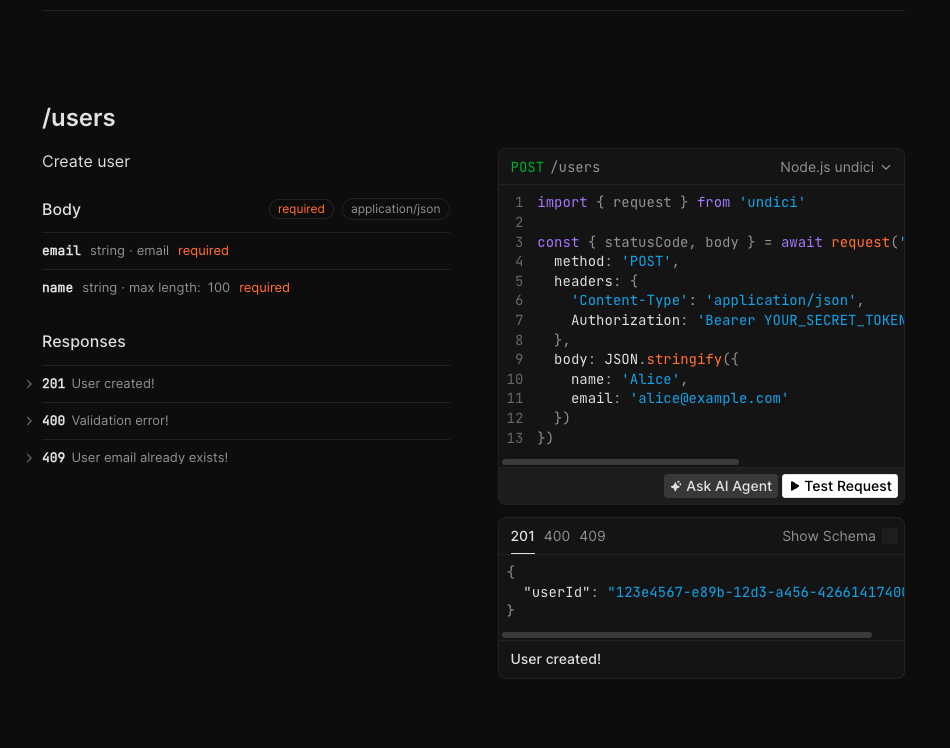

# OpenAI API Exploration with Fastify

---

A simple project built to explore the OpenAI API using Fastify, TypeScript, and OpenAPI documentation.



> The idea was to keep the project intentionally small and use it as a practical way to experiment with the API, its responses, and the overall developer experience.

---

## Stack

- Node.js
- TypeScript
- Fastify
- @sinclair/typebox
- @fastify/type-provider-typebox
- @fastify/swagger
- @scalar/fastify-api-reference
- @fastify/cors

## What’s included

- Fastify server with TypeBox type provider
- Automatic OpenAPI schema generation from TypeBox schemas
- Full TypeScript type inference in route handlers
- Interactive API documentation with Scalar
- CORS support
- Sample `/users` endpoints (GET, POST, and GET by ID)

## Getting started

Install dependencies:

```bash
npm install
```
Run the development server:

```bash
npm run dev
```
The app runs at:

```plaintext
http://localhost:3333
```

## API documentation

OpenAPI JSON:
```plaintext
http://localhost:3333/openapi.json
```
Interactive docs (Scalar):
```plaintext
http://localhost:3333/docs
```
## Endpoints

### GET /users

Returns a paginated list of users.

**Query parameters**

| Parameter | Type | Default | Description |
|---|---|---|---|
| `page` | integer | `1` | Page number (min: 1) |
| `pageSize` | integer | `10` | Items per page (min: 1) |


**Example response**

```json
{
  "total": 1,
  "page": 1,
  "pageSize": 10,
  "data": [
    {
      "id": "a3bb189e-8bf9-3888-9912-ace4e6543002",
      "name": "Alice",
      "email": "alice@example.com"
    }
  ]
}
```

### POST /users

Creates a new user. Requires Bearer token authentication.

**Request body**

```json
{
  "name": "Alice",
  "email": "alice@example.com"
}
```
**Responses**

| Status | Description |
|---|---|
| `201` | User created successfully |
| `400` | Validation error |
| `409` | Email already exists |

### GET /users/:id

Returns a single user by their UUID.

**Path parameters**

| Parameter | Type | Description |
|---|---|---|
| `id` | string (uuid) | The user's unique identifier |

**Responses**

| Status | Description |
|---|---|
| `200` | User found |
| `404` | User not found |

**Example response**

```json
{
  "id": "a3bb189e-8bf9-3888-9912-ace4e6543002",
  "name": "Alice",
  "email": "alice@example.com"
}
```

---

> ## Notes
> Schemas are defined with TypeBox — a single source of truth for validation, TypeScript types, and OpenAPI documentation. No separate spec file needed.

---

### Licence

ISC

---

## 👩‍💻 Author

Created by **Patricia Segantine**  
Senior Frontend Engineer | Exploring backend development

🔗 GitHub: [@patriciasegantine](https://github.com/patriciasegantine)  
🔗 LinkedIn: [Patricia Segantine](https://www.linkedin.com/in/patriciasegantine/)
